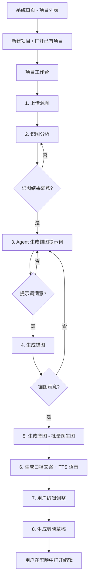
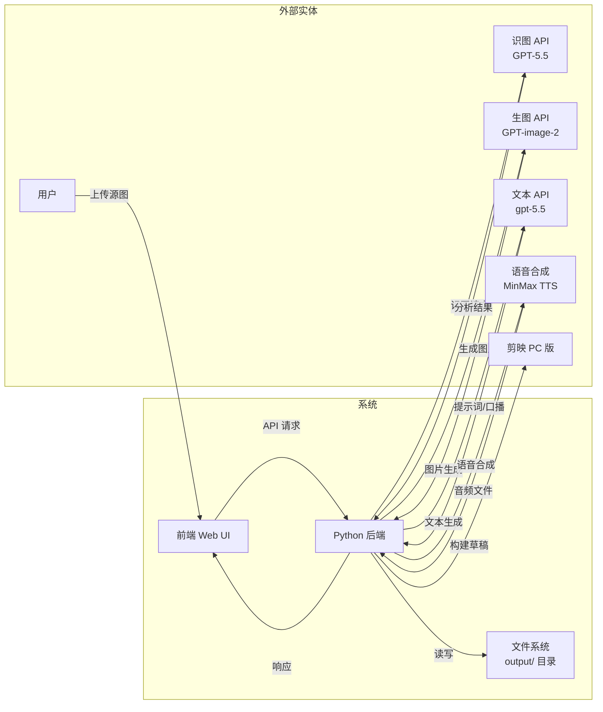
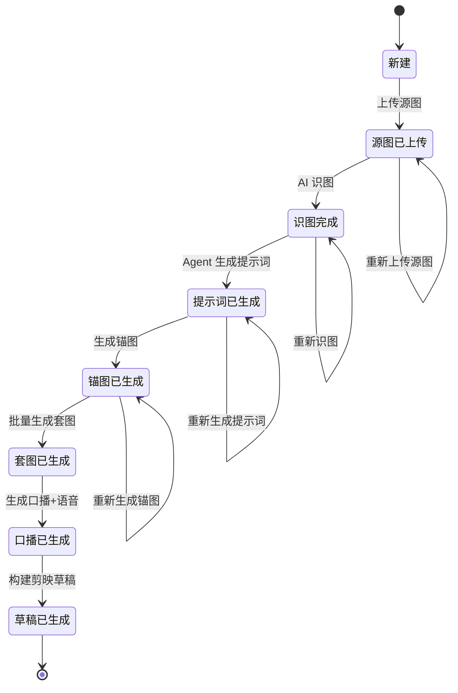
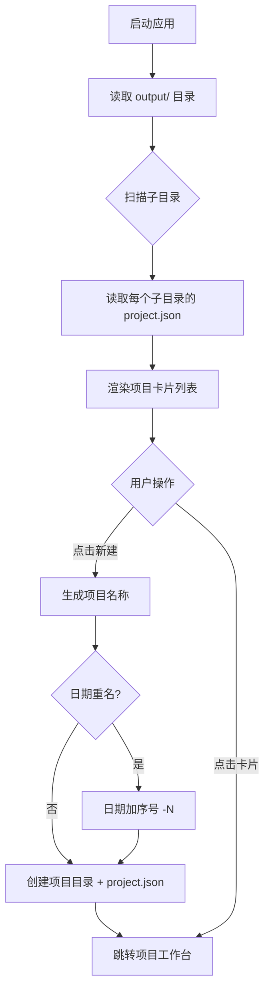

# 光伏短视频内容制作工具 产品需求文档（PRD）

版本号：V1.0.2

| 版本   | 时间       | 修订人 | 备注             |
|--------|-----------|--------|-----------------|
| V1.0.0 | 2026/05/26 | AI Agent | 创建 V1.0.0 版本 |
| V1.0.1 | 2026/05/26 | AI Agent | 根据 .env 实际配置更新 API 集成章节 |
| V1.0.2 | 2026/05/26 | AI Agent | 评审修复：统一模型名称、补充步骤回退规则、图片不删仅移至已弃用、自定义套图交互 |

---

## 一、概述（为什么做）

### 1.1 产品概述及目标

#### 1.1.1 背景介绍

工商业光伏投资方的核心获客模式是：通过短视频内容（抖音/快手/视频号）展示光伏电站案例，吸引拥有厂房资源的"居间人"（中间介绍人）主动联系合作。目前内容制作流程完全依赖人工：找素材→P图→写文案→配音→剪辑，单条视频耗时 2-4 小时，难以规模化和批量化。

#### 1.1.2 产品概述

光伏短视频内容制作工具是一个**本地 Web 工具**，面向光伏投资方的内容运营人员。核心能力：用户提供一张参考厂房图 → AI 自动识图 → 生成一套多视角光伏安装前后的场景图 → 生成口播文案 → AI 语音合成 → 自动构建剪映草稿。用户只需在剪映中微调即可导出成品视频。

#### 1.1.3 产品目标

**业务目标**

| 目标 | 指标 | 目标值 | 达成时间 |
|------|------|--------|---------|
| 降低单条视频制作耗时 | 单条视频从素材准备到草稿完成的时间 | 从 2-4 小时降至 15 分钟以内 | V1.0 上线 |
| 批量产出能力 | 单次操作可产出的视频素材量 | ≥ 12 张套图 + 对应口播 | V1.0 上线 |

**用户目标**

| 目标用户 | 用户目标 | 衡量指标 |
|---------|---------|---------|
| 光伏投资方内容运营 | 用一张参考图快速生成全套短视频素材 | 从上传源图到生成剪映草稿 < 15 分钟 |
| 光伏投资方内容运营 | 自动化生成口播文案和语音 | 每张图的口播文案生成成功率 > 95% |

#### 1.1.4 目标用户

| 角色 | 描述 | 核心诉求 |
|------|------|---------|
| 内容运营人员 | 光伏投资公司的短视频运营，负责制作和发布短视频 | 快速、批量生产短视频内容，降低制作门槛 |

> 注：V1.0 为单人本地使用，只有单一角色，无多用户权限体系。

### 1.2 名词说明

| 名词 | 说明 |
|------|------|
| 源图 | 用户从网上找到的已安装光伏设备的工商业屋顶参考图，用作 AI 识别的输入 |
| 锚图 | 基于源图进行 AI 识图分析后，通过优化提示词重新文生图生成的高质量参考图，作为套图生成的基准 |
| 套图 | 以锚图为参考，用图生图方式按不同尺寸（16:9/9:16）和不同视角（厂房正门/屋顶安装前中后）生成的一组图片，共 12 张 |
| 居间人 | 拥有厂房资源、为光伏投资方介绍屋顶资源的中间介绍人 |
| 项目 | 以日期命名的内容制作单元，一个项目 = 一条短视频的完整素材包 |
| 口播 | AI 生成并合成的语音旁白，与每张套图一一对应 |

### 1.3 角色及权限

| 角色 | 权限范围 | 说明 |
|------|---------|------|
| 本地用户（默认） | 全部功能 | V1.0 为单人本地工具，无登录鉴权 |

### 1.4 文档阅读对象

| 对象 | 关注内容 |
|------|---------|
| 研发 | 功能需求、API 接口、数据字典、剪映草稿构建方案 |
| 用户（内容运营） | 操作流程、界面交互 |

---

## 二、产品描述（做什么）

### 2.1 产品需求描述

本工具实现从一张参考厂房图到一条完整短视频草稿的全自动化流式：

1. 用户上传源图 → AI 识别厂房特征和周边环境
2. Agent 优化提示词（调用 gpt-5.5）→ 生成高质量锚图
3. 以锚图为参考 → 批量图生图生成 12 张多视角套图
4. AI 为每张套图生成口播文案 → TTS 合成语音
5. 组装为剪映草稿（图片 + 文字 + 语音 + 背景音乐）→ 用户在剪映中打开微调导出

**不做什么（V1.0）：**
- 不做视频自动导出和发布（依赖剪映）
- 不做多用户协作
- 不做云端存储（纯本地）

**硬性约束：**
- 所有 API 密钥通过 `.env` 文件配置，不硬编码
- 所有生成内容存储在 `output/` 目录，按项目名组织
- 仅支持 Windows 环境（依赖剪映 PC 版）

### 2.2 产品整体流程

#### 2.2.1 主流程



#### 2.2.2 子流程：套图生成

```mermaid
flowchart TD
    A[用户点击"生成套图"] --> B[读取套图配置]
    B --> C[遍历套图配置项]
    C --> D{遍历完?}
    D -->|否| E[构建图生图 prompt]
    E --> F[调用生图 API]
    F --> G[轮询任务状态]
    G --> H{完成?}
    H -->|否| G
    H -->|是| I[下载图片到 output]
    I --> C
    D -->|是| J[展示套图列表]
```

#### 2.2.3 数据流图（DFD）



#### 2.2.4 状态转换图：项目状态



**步骤回退规则：**

用户可自由点击左侧步骤导航跳转到任意已完成步骤。修改前序步骤时，级联规则如下：

| 用户操作 | 影响范围 | 处理方式 |
|---------|---------|---------|
| 重新上传源图 | 步骤 2~8 | 识图/提示词/锚图/套图/口播/草稿 标记为"待更新"（不删除），提示用户需重新执行 |
| 重新识图分析 | 步骤 3~8 | 提示词/锚图/套图/口播/草稿 标记为"待更新" |
| 重新生成提示词 | 步骤 4~8 | 锚图/套图/口播/草稿 标记为"待更新" |
| 重新生成锚图 | 步骤 5~8 | 原锚图移至 `images/discarded/`；套图/口播/草稿 标记为"待更新"（保留套图，不清空） |
| 单张套图重新生成 | 仅该套图 | 原图移至 `images/discarded/set_<id>_<timestamp>.png` |

**图片保留策略（硬规则）：**

> AI 生成的所有图片**永不删除**。点击"重新生成"时，原图移至 `images/discarded/` 目录，文件名追加时间戳避免冲突。

```
output/<项目名>/images/
├── source.png              # 源图
├── anchor.png              # 锚图（当前版本）
├── set_01_16x9.png         # 套图（当前版本）
├── ...
└── discarded/              # 已弃用（历史版本，不自动清理）
    ├── anchor_20260526_143021.png
    └── set_03_9x16_20260526_150512.png
```

### 2.3 全局说明

#### 2.3.1 全局异常处理

| 异常场景 | 处理方式 | 提示文案 |
|---------|---------|---------|
| API 调用失败 | 显示错误详情，支持重试 | "API 调用失败：[具体错误信息]，点击重试" |
| API 超时 | 显示超时提示，支持重试 | "API 响应超时，请稍后重试" |
| 网络异常 | 显示提示 | "网络连接异常，请检查网络" |
| API Key 无效 | 引导用户检查 .env 配置 | "API Key 无效或已过期，请检查 .env 文件" |
| 文件不存在 | 显示文件路径提示 | "文件 [路径] 不存在" |
| 磁盘空间不足 | 提示清理磁盘 | "磁盘空间不足，请清理 output 目录" |
| 生图任务失败 | 标记该图片失败，展示失败原因，支持单独重试 | "生成失败：[原因]" |

#### 2.3.2 全局交互

| 场景 | 交互方式 |
|------|---------|
| 操作成功 | Toast 提示，3秒消失 |
| 操作失败 | Toast 提示错误信息，红色 |
| API 调用中 | 按钮显示 loading 状态 + 禁用 |
| 批量生图 | 显示总体进度条 + 各图片独立状态（排队/生成中/完成/失败） |
| 图片加载 | 显示骨架屏占位 |
| 异步操作 | 按钮置灰 + loading icon，禁止重复提交 |
| 可编辑字段 | 失焦自动保存，Enter 键确认，Esc 取消 |

#### 2.3.3 文件存储规则

```
output/
└── <项目名称>/           # 如 "2026-05-26" 或 "2026-05-26-2"
    ├── project.json       # 项目元数据（所有状态、提示词、口播内容）
    ├── images/
    │   ├── source.png     # 源图
    │   ├── anchor.png     # 锚图
    │   ├── set_<id>_16x9.png    # 套图 16:9
    │   └── set_<id>_9x16.png    # 套图 9:16
    ├── audio/
    │   ├── narration_<id>.mp3   # 口播音频
    │   └── bgm.mp3              # 背景音乐
    └── draft/              # 剪映草稿（由 pyJianYingDraft 生成）
```

### 2.4 产品版本规划

| 版本 | 范围 | 计划时间 | 状态 |
|------|------|---------|------|
| V1.0 | 核心流程：源图→识图→锚图→套图→口播→剪映草稿 | 2026/06 | 规划中 |
| V1.1 | 套图配置自定义、口播文案批量调整、多音乐轨道 | TBD | 远期 |
| V2.0 | 多账号分发、数据看板、模板市场 | TBD | 远期 |

### 2.5 产品框架

```
光伏短视频工具
├── 项目列表页（首页）
│   ├── 项目卡片列表
│   └── 新建项目按钮
├── 项目工作台
│   ├── 左侧：步骤导航（1~8 步）
│   ├── 中间：主操作区（随步骤切换）
│   └── 右侧：当前步骤的预览/结果区
├── 设置页
│   ├── API 配置
│   ├── 套图配置
│   ├── 音频配置
│   └── 提示词 Agent 配置
└── 输出目录
    └── 按项目组织的图片/音频/草稿文件
```

### 2.6 功能清单

| 模块 | 功能 | 优先级 | 说明 |
|------|------|--------|------|
| 项目管理 | 项目列表展示 | P0 | 首页，卡片式列表，显示缩略图和名称 |
| 项目管理 | 新建项目 | P0 | 以当前日期命名，重名加序号 |
| 项目管理 | 打开/切换项目 | P0 | 点击卡片进入项目工作台 |
| 项目管理 | 删除项目 | P2 | 二次确认后删除整个项目目录 |
| 图片生成 | 源图上传 | P0 | 支持拖拽/点击上传 |
| 图片生成 | 识图分析 | P0 | 调用 GPT-5.5 Vision API |
| 图片生成 | Agent 提示词优化 | P0 | 调用 gpt-5.5，支持重生成和手动编辑 |
| 图片生成 | 锚图生成 | P0 | 调用 GPT-image-2 文生图 |
| 图片生成 | 批量套图生成 | P0 | 图生图模式，并行调用，进度轮询 |
| 图片生成 | 套图列表展示 | P0 | 16:9 / 9:16 双 Tab，每行含缩略图/提示词/文字/口播/操作按钮 |
| 图片生成 | 单张套图重新生成 | P1 | 仅重新生成当前图片 |
| 图片生成 | 新增自定义套图 | P1 | 用户添加合同/备案/收款等自定义图片 |
| 内容生成 | 批量口播文案生成 | P0 | 调用 gpt-5.5 为每张图生成口播 |
| 内容生成 | 单张口播重新生成 | P1 | 重新生成单张图片的口播 |
| 内容生成 | 口播内容编辑 | P0 | 文本输入框，可手动编辑 |
| 内容生成 | 显示文字编辑 | P0 | 文本输入框，可手动编辑（视频中的叠加文字） |
| 音频 | TTS 语音合成 | P0 | 调用 MinMax TTS，默认男声 |
| 音频 | 背景音乐上传 | P1 | 用户上传本地音频文件 |
| 草稿构建 | 生成剪映草稿 | P0 | 使用 pyJianYingDraft 创建模式，按选定比例（16:9/9:16）构建 |
| 草稿构建 | 在剪映中打开 | P1 | 可选：自动唤起剪映打开草稿 |
| 设置 | API 配置管理 | P0 | 生图/识图/文本 三个 API 的 BaseUrl+Key+Model |
| 设置 | 套图配置管理 | P1 | 管理套图尺寸/视角配置，支持新增和删除 |
| 设置 | 音频配置 | P1 | TTS 音色选择、语速等 |
| 设置 | 提示词 Agent 配置 | P1 | 优化策略、地域偏好等 |

---

## 三、功能需求（怎么做）

---

### 3.1 项目列表页（首页）

#### 3.1.1 描述

系统启动后默认展示的页面，列出所有已创建的项目。

#### 3.1.2 用户故事

```
作为内容运营，我希望在首页看到所有项目列表，以便快速进入某个项目继续工作。
作为内容运营，我希望一键创建新项目，无需手动填写信息。
```

#### 3.1.3 前置条件

| 类型 | 条件 |
|------|------|
| 系统依赖 | `.env` 文件存在于项目根目录 |
| 文件系统 | `output/` 目录存在（首次启动自动创建） |

#### 3.1.4 后置条件

- 新建项目：在 `output/` 下创建项目目录和 `project.json`
- 打开项目：导航到项目工作台

#### 3.1.5 界面及交互

**页面布局：**
- 顶部：应用标题 "光伏短视频工具"
- 右上角：设置按钮（齿轮图标）
- 主体：项目卡片网格（3 列自适应）
- 右下角浮动按钮：新建项目（+ 图标）

**项目卡片：**
- 源图缩略图（120×68px），无源图时显示占位图
- 项目名称
- 当前进度状态标签（新建/源图已上传/.../草稿已生成）
- 创建时间

| 元素 | 类型 | 必填 | 默认值 | 校验规则 | 操作反馈 |
|------|------|------|--------|---------|---------|
| 新建项目按钮 | 浮动按钮 | - | - | - | 创建新项目并跳转 |
| 设置按钮 | 图标按钮 | - | - | - | 跳转设置页 |
| 项目卡片 | 可点击卡片 | - | - | - | 点击进入项目工作台 |

#### 3.1.6 业务流程



#### 3.1.7 异常/分支流程

| 场景 | 触发条件 | 处理方式 | 提示文案 |
|------|---------|---------|---------|
| output 目录不存在 | 首次启动 | 自动创建 output 目录 | - |
| project.json 损坏 | JSON 解析失败 | 跳过该项目，标记为"数据异常" | "项目 [名称] 数据异常" |
| 项目目录无 project.json | 手动删除或创建异常 | 视为空项目，展示默认状态 | - |

#### 3.1.8 数据字典

**project.json 结构：**

| 字段名 | 类型 | 必填 | 说明 | 示例值 |
|--------|------|------|------|--------|
| name | String | 是 | 项目名称 | "2026-05-26" 或 "2026-05-26-2" |
| created_at | DateTime | 是 | 创建时间 | "2026-05-26 10:30:00" |
| updated_at | DateTime | 是 | 最后更新时间 | "2026-05-26 14:20:00" |
| status | Enum | 是 | 项目状态: new/source_uploaded/vision_done/prompt_done/anchor_done/set_done/narration_done/draft_done | "anchor_done" |
| source_image | String | 否 | 源图相对路径 | "images/source.png" |
| vision_result | Object | 否 | 识图分析结果 | `{"building":"三层厂房","surroundings":"广东工业园区,有空调外机"}` |
| anchor_prompt | String | 否 | 锚图提示词 | "一座广东工业园区的三层厂房..." |
| anchor_image | String | 否 | 锚图相对路径 | "images/anchor.png" |
| set_images | Array | 是 | 套图配置列表 | 见 3.6.8 数据字典 |
| bgm_path | String | 否 | 背景音乐路径 | "audio/bgm.mp3" |

---

### 3.2 项目工作台

#### 3.2.1 描述

进入项目后的主操作页面，左侧 8 步导航，中间主操作区。

#### 3.2.2 用户故事

```
作为内容运营，我希望按步骤引导完成整个内容制作流程，每步结果都能预览和调整。
```

#### 3.2.3 前置条件

| 类型 | 条件 |
|------|------|
| 数据依赖 | 项目已在 output 目录中创建 |
| API 依赖 | .env 中已配置三个 API 的 Key（部分步骤需要） |

#### 3.2.4 界面及交互

**页面布局：**
- 左侧：步骤导航条（垂直，8 步），当前步骤高亮，已完成步骤打勾
- 主体区域：当前步骤的操作界面
- 底部：上一步 / 下一步按钮

#### 3.2.5 步骤列表

| 步骤 | 名称 | 描述 |
|------|------|------|
| 1 | 源图提交 | 上传参考厂房图 |
| 2 | 识图分析 | AI 分析图片内容 |
| 3 | 提示词优化 | Agent 生成锚图提示词 |
| 4 | 锚图生成 | 文生图生成基准图 |
| 5 | 套图生成 | 批量图生图 |
| 6 | 内容编辑 | 编辑文字+口播 |
| 7 | 语音合成 | TTS 合成口播音频 |
| 8 | 生成草稿 | 构建剪映草稿 |

---

### 3.3 步骤 1：源图提交

#### 3.3.1 描述

用户从网上找到一张已安装光伏设备的工商业屋顶图，上传到系统。

#### 3.3.2 用户故事

```
作为内容运营，我希望能上传一张参考厂房图，系统能保存并用于后续分析。
```

#### 3.3.3 前置条件

| 类型 | 条件 |
|------|------|
| 数据依赖 | 项目已创建 |

#### 3.3.4 后置条件

- 源图保存到 `output/<项目名>/images/source.png`
- project.json 更新 source_image 字段

#### 3.3.5 界面及交互

**主操作区：**
- 上传区域（拖拽+点击上传），200×112px 预览区
- 支持格式：JPG、PNG、WEBP
- 上传后显示缩略图（小图）用于与锚图对比
- 底部：已上传缩略图 + "下一步" 按钮

| 元素 | 类型 | 必填 | 默认值 | 校验规则 | 操作反馈 |
|------|------|------|--------|---------|---------|
| 上传区域 | 拖拽上传区 | 是 | - | JPG/PNG/WEBP，≤20MB | 上传成功显示缩略图 |
| 替换按钮 | 文字按钮 | - | - | - | 支持重新上传替换 |

#### 3.3.6 异常/分支流程

| 场景 | 触发条件 | 处理方式 | 提示文案 |
|------|---------|---------|---------|
| 文件格式不支持 | 上传非 JPG/PNG/WEBP | 拒绝上传 | "仅支持 JPG、PNG、WEBP 格式" |
| 文件过大 | 文件 > 20MB | 拒绝上传 | "文件大小不能超过 20MB" |
| 未上传即点下一步 | 无源图 | 阻止跳转 | "请先上传源图" |

---

### 3.4 步骤 2：识图分析

#### 3.4.1 描述

调用 GPT-5.5 Vision API 分析源图，提取主体建筑、周边环境等信息。

#### 3.4.2 用户故事

```
作为内容运营，我希望 AI 能自动分析源图中的厂房特征，以便后续生成更精准的提示词。
```

#### 3.4.3 前置条件

| 类型 | 条件 |
|------|------|
| 数据依赖 | 源图已上传 |
| API 依赖 | 识图 API 已配置（GPT-5.5） |

#### 3.4.4 后置条件

- project.json 更新 vision_result
- 可进入步骤 3

#### 3.4.5 界面及交互

**主操作区：**
- 左侧：源图缩略图（小图）
- 右侧：识图结果展示区（可编辑的文本框）
- 底部按钮：重新分析、下一步

| 元素 | 类型 | 必填 | 默认值 | 校验规则 | 操作反馈 |
|------|------|------|--------|---------|---------|
| 识图结果 | 多行文本框 | - | API 返回结果 | - | 可手动编辑 |
| 重新分析 | 按钮 | - | - | - | 重新调用识图 API，覆盖结果 |

#### 3.4.6 识图 Prompt 模板

```
请详细分析这张图片中的建筑和环境：
1. 主体建筑类型（厂房/仓库/办公楼）、层数、外观特征（外墙颜色、材质）
2. 屋顶特征：面积大小、结构类型（平顶/坡顶）、已安装光伏板的位置和规模
3. 周边环境：是否在工业园区、是否有其他厂房、道路、绿化、围墙
4. 配套设施：是否有空调外机、变压器、停车场、装卸货区等
5. 整体氛围：是否有运行中的感觉（有人、有车、有设备运转痕迹）
请用简洁的中文描述，作为后续 AI 生成图片的参考信息。
```

输出格式要求：
- 纯文本描述，无 Markdown 格式
- 聚焦视觉可识别特征
- 如有不确定的特征，标注为"疑似"

#### 3.4.7 异常/分支流程

| 场景 | 触发条件 | 处理方式 | 提示文案 |
|------|---------|---------|---------|
| API 调用失败 | 网络/Key 无效 | 显示错误，支持重试 | "识图分析失败：[错误信息]" |
| 图片不含建筑 | AI 返回空或无关内容 | 提示用户更换图片 | "未识别到建筑特征，请更换包含厂房的图片" |

---

### 3.5 步骤 3：Agent 提示词优化

#### 3.5.1 描述

以识图分析结果为输入，调用 gpt-5.5 优化生成锚图的提示词。用户可重新生成或手动编辑。

#### 3.5.2 用户故事

```
作为内容运营，我希望 AI 能根据识图结果自动生成高质量的文生图提示词，确保生成的图片适合短视频使用。
```

#### 3.5.3 前置条件

| 类型 | 条件 |
|------|------|
| 数据依赖 | 识图分析已完成 |
| API 依赖 | 文本 Agent API 已配置（gpt-5.5） |

#### 3.5.4 后置条件

- project.json 更新 anchor_prompt 字段

#### 3.5.5 界面及交互

**主操作区：**
- 上半部分：识图分析结果（只读参考）
- 中间：提示词展示区（可编辑的大文本框，4 行）
- 底部按钮：重新生成、下一步

| 元素 | 类型 | 必填 | 默认值 | 校验规则 | 操作反馈 |
|------|------|------|--------|---------|---------|
| 提示词 | 多行文本框 | - | Agent 生成结果 | 非空 | 可手动编辑 |
| 重新生成 | 按钮 | - | - | - | 重新调用 Agent，覆盖结果 |

#### 3.5.6 提示词优化 Prompt 模板

```
你是一个专业的 AI 图片生成提示词工程师。请基于以下建筑描述，生成一个高质量的文生图提示词。

【建筑描述】
{vision_result}

【要求】
1. 目标：生成一张中国广东工业园区的工商业厂房外观图，用于光伏短视频的背景图
2. 画面中不能出现任何文字、logo、水印、明显的品牌标识
3. 建筑要有空调外机、厂房外观真实、不能像无人区，要有运行中的感觉
4. 周边环境要真实：有道路、绿化、隔壁厂房、车辆等
5. 天气晴朗、白天、自然光线
6. 画质高清、写实风格
7. 图片比例：16:9

【输出格式】
只输出英文 prompt，适合直接传给 DALL-E / Stable Diffusion 等文生图 API。
同时再输出一个中文版本放在下方，方便用户阅读。

中文版本：
```
{中文prompt}
```
```

#### 3.5.7 异常/分支流程

| 场景 | 触发条件 | 处理方式 | 提示文案 |
|------|---------|---------|---------|
| Agent 生成失败 | API 异常 | 显示错误，支持重试 | "提示词生成失败：[错误信息]" |
| 提示词为空 | API 返回空 | 不允许进入下一步 | "提示词不能为空，请重新生成或手动输入" |

---

### 3.6 步骤 4 & 5：锚图生成 & 套图生成

#### 3.6.1 描述

步骤 4：基于提示词调用 GPT-image-2 文生图生成锚图。用户满意确认后进入步骤 5。
步骤 5：以锚图为参考图，按套图配置批量调用 GPT-image-2 图生图，生成不同视角和尺寸的套图。

#### 3.6.2 用户故事

```
作为内容运营，我希望先生成一张基准锚图确认效果，再批量生成全套多视角图。
```

#### 3.6.3 前置条件

| 类型 | 条件 |
|------|------|
| 数据依赖 | 步骤 4：提示词已生成；步骤 5：锚图已确认 |
| API 依赖 | 生图 API 已配置（GPT-image-2） |

#### 3.6.4 后置条件

- 步骤 4：锚图保存到 `output/<项目>/images/anchor.png`
- 步骤 5：套图保存到 `output/<项目>/images/set_<index>_16x9.png` 和 `set_<index>_9x16.png`

#### 3.6.5 界面及交互

**步骤 4（锚图生成）：**
- 提示词（只读参考）
- 锚图展示区（大图，400×225px）
- 底部按钮：重新生成、确认并生成套图

**步骤 5（套图生成）：**
- 顶部：锚图缩略图（参考）
- 进度条：整体进度 "已完成 3/12"
- 套图列表（两个 Tab：16:9 | 9:16）
- Tab 内图片按固定顺序排列：
  1. 厂房正门
  2. 未安装-厂房屋顶
  3. 安装中-厂房屋顶工人安装支架
  4. 安装中-厂房屋顶-吊车吊光伏组件-工人安装组件
  5. 安装后-厂房屋顶
  6. 安装前中后对比
- 每张图片独立显示状态：排队中 / 生成中（loading动画） / 已完成（显示缩略图） / 失败（红色标记+重试按钮）

#### 3.6.6 套图默认配置

| 序号 | 比例 | 视角 | 描述 | 变化说明 |
|------|------|------|------|---------|
| 1 | 16:9 | 平视 | 厂房正门 | 参考锚图，保持建筑一致，展示正门入口 |
| 2 | 16:9 | 无人机视角 | 未安装-厂房屋顶 | 鸟瞰屋顶，空旷无光伏板 |
| 3 | 16:9 | 无人机视角 | 安装中-工人在安装支架 | 屋顶有工人在安装光伏支架 |
| 4 | 16:9 | 无人机视角 | 安装中-吊车吊组件 | 屋顶有吊车及工人在安装光伏组件 |
| 5 | 16:9 | 无人机视角 | 安装后-厂房屋顶 | 鸟瞰屋顶，布满光伏板 |
| 6 | 16:9 | 无人机视角 | 安装前中后对比 | 三格分屏：安装前→安装中→安装后 |
| 7 | 9:16 | 平视 | 厂房正门 | 同1，竖屏比例 |
| 8 | 9:16 | 无人机视角 | 未安装-厂房屋顶 | 同2，竖屏比例 |
| 9 | 9:16 | 无人机视角 | 安装中-工人在安装支架 | 同3，竖屏比例 |
| 10 | 9:16 | 无人机视角 | 安装中-吊车吊组件 | 同4，竖屏比例 |
| 11 | 9:16 | 无人机视角 | 安装后-厂房屋顶 | 同5，竖屏比例 |
| 12 | 9:16 | 无人机视角 | 安装前中后对比 | 同6，竖屏比例 |

#### 3.6.7 套图生成 Prompt 模板（图生图）

每张套图调用 GPT-image-2 图生图接口时，prompt 由两部分组成：
- **参考图**：锚图（anchor.png），确保主体建筑一致性
- **差异描述**：每张套图特有的变化描述

```
# 以套图 #2（16:9 无人机视角-未安装屋顶）为例：

【参考图】{anchor.png}
【变化描述】
A drone aerial view directly above the same factory rooftop. The roof is clean and empty, no solar panels installed yet. Clear view of the roof structure. Same factory building, same surroundings, same lighting conditions as the reference image.
```

#### 3.6.8 数据字典：套图配置项

| 字段名 | 类型 | 必填 | 说明 | 示例值 |
|--------|------|------|------|--------|
| id | String | 是 | 唯一标识 | "set_02" |
| aspect_ratio | Enum | 是 | 比例: "16:9" / "9:16" | "16:9" |
| view_angle | Enum | 是 | 视角: "eye_level" / "drone" | "drone" |
| scene | String | 是 | 场景描述 | "未安装-厂房屋顶" |
| prompt_diff | String | 是 | 与锚图的差异描述（英文 prompt） | "drone view, empty rooftop..." |
| order | Int | 是 | 排序序号 | 2 |
| generated_image | String | 否 | 生成后的图片路径 | "images/set_02_16x9.png" |
| display_text | String | 否 | 视频要显示的文字 | "工商业屋顶光伏安装前" |
| narration | String | 否 | 口播文案 | "这是位于广东东莞的一处..." |
| narration_audio | String | 否 | 口播音频路径 | "audio/narration_02.mp3" |
| status | Enum | 是 | 状态: pending/generating/done/failed | "done" |

---

### 3.7 步骤 6：内容编辑

#### 3.7.1 描述

用户查看套图列表，编辑每张图片的"显示文字"和"口播内容"，可触发 AI 批量生成口播文案，也可逐张重新生成图或口播。

#### 3.7.2 用户故事

```
作为内容运营，我希望能为每张套图分别编辑文字和口播内容，确保信息准确。
作为内容运营，我希望能一键批量生成所有套图的口播文案。
```

#### 3.7.3 前置条件

| 类型 | 条件 |
|------|------|
| 数据依赖 | 套图已生成（至少一张） |
| API 依赖 | 文本 Agent API（口播生成需要） |

#### 3.7.4 界面及交互

**套图列表（核心页面）：**

两个 Tab 切换：`16:9 横屏` | `9:16 竖屏`

每张套图一行，行内包含：

| 元素 | 类型 | 说明 |
|------|------|------|
| 套图缩略图 | 图片 | 160×90px (16:9) 或 90×160px (9:16)，点击放大 |
| 提示词 | 只读文本 | 折叠显示，点击展开 |
| 显示文字 | 可编辑输入框 | 视频中叠加显示的文字，1~20 字 |
| 口播内容 | 可编辑文本区 | 3~10 行文本区，自动高度 |
| 重新生图 | 按钮 | 仅重新生成当前这张套图 |
| 生成口播 | 按钮 | 仅为当前这张套图生成口播文案 |

**顶部操作栏：**
- 批量生成口播按钮
- 新增自定义套图按钮（弹出对话框：上传本地图片 + 输入场景说明，如"合同签订现场"/"备案材料"/"收款凭证"）
- 上传背景音乐按钮

#### 3.7.5 口播文案生成 Prompt

```
你是一个光伏行业的短视频文案。请基于以下图片场景，写一段 15~30 秒的口播文案。

【场景】{套图的 scene 描述}
【视角】{套图的 view_angle 描述}
【参考信息】{vision_result}

要求：
1. 第一人称，投资方视角
2. 语气：专业、可信赖、不浮夸
3. 内容结构：描述场景 → 强调光伏投资价值 → 号召居间人联系
4. 字数：80~150 字
5. 不出现具体公司名称、电话、微信号（后续用户自行添加）

【输出】
只输出口播文案纯文本。
```

#### 3.7.6 数据字典：用户自定义套图

除默认 12 张套图外，用户可新增自定义记录：

| 字段名 | 类型 | 必填 | 说明 | 示例值 |
|--------|------|------|------|--------|
| id | String | 是 | 唯一标识 | "custom_01" |
| is_custom | Bool | 是 | 固定为 true | true |
| aspect_ratio | Enum | 是 | 比例 | "16:9" |
| scene | String | 是 | 场景说明 | "合同签订现场" |
| custom_image | String | 是 | 用户上传的本地图片路径 | "images/custom_01.png" |
| display_text | String | 否 | 显示文字 | "合同已签，项目启动" |
| narration | String | 否 | 口播文案 | "这家企业的合同已经签下来了..." |
| narration_audio | String | 否 | 口播音频路径 | "audio/narration_custom_01.mp3" |
| order | Int | 是 | 排序 | 13 |

> **自定义套图的来源**：用户本地上传（支持 JPG/PNG/WEBP）。不走 AI 生图流程，直接使用用户提供的图片。

#### 3.7.7 异常/分支流程

| 场景 | 触发条件 | 处理方式 | 提示文案 |
|------|---------|---------|---------|
| 批量口播生成部分失败 | 某些张生成失败 | 标记失败的图片，成功的保留 | "X 张口播生成失败，可点击重试" |
| 显示文字超长 | 输入 > 20 字 | 截断并提示 | "显示文字不超过 20 字" |

---

### 3.8 步骤 7：语音合成

#### 3.8.1 描述

调用 MinMax TTS API 将每张套图的口播文案合成为 MP3 音频文件。音频时长决定了该图片在剪映草稿中的播放时长。

#### 3.8.2 用户故事

```
作为内容运营，我希望 AI 能自动将口播文案合成为语音，并在剪映中与对应图片时长同步。
```

#### 3.8.3 前置条件

| 类型 | 条件 |
|------|------|
| 数据依赖 | 套图的口播文案已填写 |
| API 依赖 | MinMax TTS API Key（在 .env 中配置） |

#### 3.8.4 后置条件

- 音频文件保存到 `output/<项目>/audio/narration_<id>.mp3`
- project.json 更新每张套图的 `narration_audio` 和 `audio_duration`（微秒）

#### 3.8.5 界面及交互

**语音合成页面：**
- 显示待合成的口播列表（每图一行）
- 状态指示：排队 / 合成中 / 已完成 / 失败
- 每行可试听（播放按钮）
- 顶部：一键全部合成按钮

| 元素 | 类型 | 说明 |
|------|------|------|
| 一键合成 | 按钮 | 遍历所有套图，串行或并行调用 TTS |
| 试听按钮 | 图标按钮 | 播放已合成的音频 |
| 单条重试 | 文字按钮 | 重新合成某条的音频 |

#### 3.8.6 MinMax TTS 调用

- 音色：默认男声（可在设置中切换）
- 格式：MP3
- 采样率：32000 Hz（与剪映兼容）
- 将合成后的 MP3 文件保存，并用 `pymediainfo` 读取音频时长（微秒），写入套图数据

#### 3.8.7 异常/分支流程

| 场景 | 触发条件 | 处理方式 | 提示文案 |
|------|---------|---------|---------|
| TTS 合成失败 | API 异常 | 标记失败，支持重试 | "语音合成失败：[错误信息]" |
| 音频时长异常 | 音频 < 1s 或 > 60s | 标注但允许继续 | "音频时长异常（x秒），请检查口播文案长度" |

---

### 3.9 步骤 8：生成剪映草稿

#### 3.9.1 描述

调用 pyJianYingDraft 库的创建模式，将套图、显示文字、口播音频、背景音乐组装为剪映草稿文件，保存到剪映草稿目录。

#### 3.9.2 用户故事

```
作为内容运营，我希望系统能自动将套图和音频组装成剪映草稿，省去手动拖拽排列的时间。
```

#### 3.9.3 前置条件

| 类型 | 条件 |
|------|------|
| 数据依赖 | 套图已生成、口播音频已合成 |
| 系统依赖 | pyJianYingDraft 已安装 |
| 系统依赖 | 剪映草稿目录存在（`E:\JianyingPro Drafts` 在配置中） |

#### 3.9.4 后置条件

- 在剪映草稿目录创建新草稿文件夹
- draft_content.json 包含完整的 track 结构

#### 3.9.5 界面及交互

**草稿生成页面：**
- 用户选择使用哪个比例的套图（16:9 / 9:16）—— 决定画布分辨率
- 显示草稿结构预览：共 N 张图，预计总时长 MM:SS
- 草稿命名（默认：项目名称 + 比例，如 "2026-05-26_16x9"）
- 生成按钮

| 元素 | 类型 | 必填 | 默认值 | 校验规则 | 操作反馈 |
|------|------|------|--------|---------|---------|
| 比例选择 | 单选按钮 | 是 | 16:9 | - | - |
| 草稿名称 | 文本输入框 | 是 | {项目名}_{比例} | 非空 | - |
| 生成草稿 | 按钮 | - | - | - | 显示生成进度 |

#### 3.9.6 剪映草稿构建逻辑

使用 pyJianYingDraft 的创建模式，构建规则如下：

```
画布分辨率：
  - 16:9 → 1920×1080
  - 9:16 → 1080×1920

轨道结构（从底到顶）：
  1. 背景音乐轨道（audio）：BGM 音频，全程循环播放
  2. 视频轨道（video）：每张套图一个片段
     - 片段时长 = 对应口播音频时长
     - 片段顺序 = 套图配置的顺序
  3. 文本轨道 1（text）：每张套图的显示文字
     - 位置：屏幕中下方
     - 字体大小：12（剪映字号，约48px）
     - 对齐：居中
  4. 音频轨道（audio）：每段口播音频
     - 片段时长 = 音频文件时长
     - 与对应图片片段时间对齐

总时长：所有套图片段时长之和
```

```python
# 伪代码示意
import pyJianYingDraft as draft

folder = draft.DraftFolder(DRAFT_DIR)

# 画布：16:9 → 1920×1080, 9:16 → 1080×1920
if aspect == "16:9":
    w, h = 1920, 1080
else:
    w, h = 1080, 1920

script = folder.create_draft(draft_name, width=w, height=h, fps=30)

# 1. 背景音乐轨道
script.add_track(draft.TrackType.audio, "背景音乐")
bgm_mat = draft.AudioMaterial(bgm_path)
script.add_material(bgm_mat)
bgm_seg = draft.AudioSegment(bgm_mat, target_timerange=trange("0s", total_duration))
script.add_segment(bgm_seg, "背景音乐")

# 2. 视频轨道
script.add_track(draft.TrackType.video, "视频轨道")

# 3. 文本轨道
script.add_track(draft.TrackType.text, "文字")

# 4. 口播音频轨道
script.add_track(draft.TrackType.audio, "口播")

current_time = 0
for img in set_images:
    audio_dur = img["audio_duration"]  # 微秒
    
    # 添加视频片段
    img_mat = draft.VideoMaterial(img["image_path"])
    script.add_material(img_mat)
    script.add_segment(
        draft.VideoSegment(img_mat, target_timerange=trange(current_time, audio_dur)),
        "视频轨道"
    )
    
    # 添加文字
    script.add_segment(
        draft.TextSegment(
            img["display_text"],
            trange(current_time, audio_dur),
            style=draft.TextStyle(size=12, align=1),
            clip_settings=draft.ClipSettings(transform_y=-0.7)
        ),
        "文字"
    )
    
    # 添加口播
    audio_mat = draft.AudioMaterial(img["narration_audio"])
    script.add_material(audio_mat)
    script.add_segment(
        draft.AudioSegment(audio_mat, target_timerange=trange(current_time, audio_dur)),
        "口播"
    )
    
    current_time += audio_dur

script.save()
```

#### 3.9.7 异常/分支流程

| 场景 | 触发条件 | 处理方式 | 提示文案 |
|------|---------|---------|---------|
| 剪映草稿目录不存在 | 目录路径配置错误 | 提示用户检查配置 | "剪映草稿目录不存在，请在设置中配置" |
| 同名草稿已存在 | draft_name 重复 | 询问覆盖或重命名 | "草稿已存在，是否覆盖？" |
| 音频文件缺失 | narration_audio 路径无效 | 跳过该段口播，图片仍保留 | "图片 [N] 的口播音频缺失，已跳过" |
| 可用 .env 文件中的剪映草稿目录路径 | - | - | 在 .env 中新增 JIANYING_DRAFT_DIR 配置项 |

---

### 3.10 设置页

#### 3.10.1 描述

集中管理所有 API 配置、套图配置、音频配置和提示词优化规则。

#### 3.10.2 界面结构

**Tab：API 配置**

| 配置项 | 说明 | 默认值（来自 .env） |
|--------|------|---------------------|
| 识图 + 文本 API BaseUrl | 统一 OpenAI 兼容端点 | `https://ai.t8star.org/v1` |
| 识图 + 文本 API Key | 统一 API Key | `sk-xxx` |
| 识图 + 文本 Model | 共用 gpt-5.5 多模态模型 | `gpt-5.5` |
| 生图 API BaseUrl | 同上 OpenAI 端点 | `https://ai.t8star.org/v1` |
| 生图 API Key | 同上 API Key | `sk-xxx` |
| 生图 Model | 主生图模型 | `gpt-image-2-all` |
| 备用生图 Model | 生图降级模型 | `gemini-3.1-flash-image-preview-2k` |
| MinMax TTS Model | 语音合成模型 | `minimax/speech-2.6-hd` |
| MinMax TTS API Key | **[待确认]** 独立 Key 或复用？ | - |
| 剪映草稿目录 | 剪映存储草稿的位置 | `E:\JianyingPro Drafts` |

**Tab：套图配置**
- 当前套图列表（可增删）
- 每项：比例、视角、场景描述、差异 prompt
- 恢复默认按钮

**Tab：音频配置**
- TTS 音色选择（下拉列表）
- 语速调节（0.5~2.0 滑块）
- 默认显示文字样式

**Tab：提示词优化规则**
- 地域选择（默认：广东）
- 附加描述词（空调外机、工业园区、运行中 等）
- 排除描述词（文字、logo、水印、品牌标识）

---

## 四、非功能需求

### 4.1 安全与合规

| 需求 | 说明 |
|------|------|
| API Key 安全 | 所有 API Key 存储在 `.env` 文件，不提交到版本控制，不在前端暴露 |
| 本地存储 | 所有数据存储在本地 `output/` 目录，不上传云端 |
| 内容合规 | 生成内容由用户自行审核，工具不承担责任 |

### 4.2 统计需求（埋点）

V1.0 为本地工具，不涉及服务端埋点。但可在本地记录以下日志：

| 事件名 | 触发时机 | 属性 | 说明 |
|--------|---------|------|------|
| project_created | 新建项目 | project_name | 项目创建统计 |
| source_uploaded | 源图上传 | file_size | - |
| vision_analyzed | 识图完成 | duration_ms, success | 识图耗时和成功率 |
| anchor_generated | 锚图生成 | duration_ms, success | - |
| set_image_generated | 单张套图生成 | index, duration_ms, success | - |
| narration_generated | 口播文案生成 | index, success | - |
| tts_synthesized | 语音合成 | index, duration_ms, success | - |
| draft_created | 草稿构建 | aspect, image_count, total_duration | - |
| api_error | API 异常 | api_type, error_code, error_msg | API 异常监控 |

### 4.3 性能需求

| 指标 | 要求 | 备注 |
|------|------|------|
| 页面首屏加载 | < 2s | 本地服务 |
| 图片预览加载 | < 1s | 本地文件读取 |
| API 超时时间 | 识图 30s / 生图 120s / 文本 30s | 可配置 |
| 套图并行数 | 4 路并发（默认） | 可配置 |

### 4.4 数据库设计

V1.0 不使用数据库，所有数据以 JSON 文件存储。数据结构见第 3.1.8 节和 3.6.8 节。

### 4.5 系统集成

**实际 API 架构（基于 `.env` 确认）：**

所有 AI API 统一通过一个 OpenAI 兼容网关 (`https://ai.t8star.org/v1`) 访问，使用同一 API Key：

```
# .env 配置项
OPENAI_API_KEY=sk-xxx
OPENAI_BASE_URL=https://ai.t8star.org/v1
OPENAI_IMAGE_MODEL=gpt-image-2-all       # 生图模型
OPENAI_GPT_MODEL=gpt-5.5                  # 文本 + 识图共用模型
GEMINI_IMAGE_MODEL=gemini-3.1-flash-image-preview-2k  # 备用生图模型
minimax_text2voice_model=minimax/speech-2.6-hd        # TTS 模型
```

| 对接系统 | 模型/端点 | 协议 | 说明 |
|---------|---------|------|------|
| 识图 API | `gpt-5.5`（多模态）| OpenAI 兼容 HTTP REST | 传入 base64 图片 + 分析 prompt |
| 文本 Agent API | `gpt-5.5` | OpenAI 兼容 HTTP REST | 提示词优化 + 口播文案，共用模型 |
| 生图 API | `gpt-image-2-all` | OpenAI 兼容 HTTP REST | 文生图（锚图）+ 图生图（套图）|
| 备用生图 | `gemini-3.1-flash-image-preview-2k` | Gemini API | 生图失败时的降级方案 |
| MinMax TTS | `minimax/speech-2.6-hd` | MinMax HTTP REST | 需单独 API Key（待确认） |
| pyJianYingDraft | 本地调用 | Python 库 | 剪映草稿生成 |
| 剪映 PC 版 | 文件系统 | 本地文件 | 读取 `E:\JianyingPro Drafts` |

**关键简化：** 识图、文本 Agent 共用同一个模型 `gpt-5.5`，减少了配置复杂度。

---

## 五、附录

### 5.1 验收标准与测试要点

| 功能 | 验收条件 | 优先级 |
|------|---------|--------|
| 新建项目 | 首页点击新建，output 下创建正确的项目目录和 project.json | P0 |
| 源图上传 | 拖拽/点击上传 JPG/PNG/WEBP，文件保存到正确路径 | P0 |
| 识图分析 | 上传厂房图后，GPT-5.5 返回结构化的建筑描述 | P0 |
| 提示词优化 | Agent 生成符合要求的英文 prompt + 中文版本 | P0 |
| 锚图生成 | 基于提示词成功生成 16:9 厂房图 | P0 |
| 套图批量生成 | 12 张套图全部生成（或标记失败），图片保存到正确路径 | P0 |
| 口播文案生成 | 每张套图生成 80~150 字口播文案 | P0 |
| 语音合成 | MinMax TTS 合成 MP3，音频时长正确 | P0 |
| 剪映草稿构建 | 在剪映草稿目录生成完整草稿，剪映能打开 | P0 |
| 编辑显示文字 | 输入框可编辑，失焦自动保存到 project.json | P0 |
| 编辑口播文案 | 文本区可编辑，失焦自动保存 | P0 |
| 新增自定义套图 | 用户上传自定义图片，添加到套图列表末尾 | P1 |
| 单张重新生图 | 点击重生成按钮，仅更新当前图片 | P1 |
| 设置页持久化 | API 配置保存后重启工具仍有效 | P0 |
| 进度状态恢复 | 关闭项目再打开，回到之前最后完成的步骤 | P1 |

### 5.2 待确认项清单

#### 必须确认（阻塞开发）

1. **[假设]** 生图 API（gpt-image-2-all）的图生图模式支持 base64 参考图输入，接口是 OpenAI 兼容格式
2. **[待确认]** MinMax TTS API Key 是独立申请还是复用网关 Key？`.env` 中未见独立 TTS Key
3. **[待确认]** 前端技术栈：纯 HTML+JS 还是需要轻量框架？
4. **[待确认]** `.env` 中 `ENABLE_GARDEN_IMAGEGEN=1` 的作用？本地是否有额外生图后端？

#### 建议确认（影响完整度）

5. **[待确认]** 页面布局方式：左侧步骤列表 + 右侧主区域？还是垂直单页多步骤滚动？
6. **[待确认]** 剪映草稿中，每张图片片段之间是否需要转场效果？
7. **[待确认]** 显示文字的字体/颜色/大小是否有品牌要求？
8. **[假设]** 背景音乐循环播放，音量约为口播音量的 30%

#### 已确认（来自 .env 分析）

9. ✅ 三个 AI API 共用网关 `https://ai.t8star.org/v1` 和同一 Key
10. ✅ 文本和识图共用模型 `gpt-5.5`
11. ✅ 生图主模型 `gpt-image-2-all`，备用 `gemini-3.1-flash-image-preview-2k`
12. ✅ TTS 模型 `minimax/speech-2.6-hd`

#### 可后续补充

13. V1.1 可考虑对接短视频平台发布 API
14. V1.1 可考虑增加视频模板预览功能
